

  

I study at the Indian Institute of Technology, Patna and build software end to end: web platforms, distributed systems, and security tooling. My work covers the front end, the back end, and the infrastructure in between, with security treated as a design requirement rather than an afterthought.

## Player Stats

  

## Achievements

  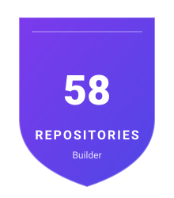
  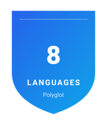
  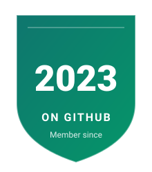
  

## Arcade

  
  
  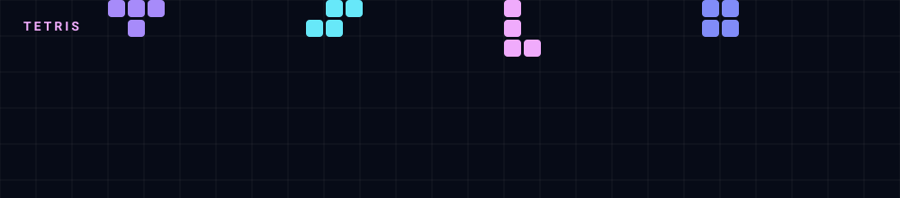

## Loadout

| Area | Technologies |
| --- | --- |
| Languages | Python, TypeScript, JavaScript, Java, Scala, C, C++ |
| Frontend | React, Next.js, Tailwind CSS, Redux |
| Backend | Node.js, Express, FastAPI, Flask, Spring |
| Data | PostgreSQL, MySQL, MongoDB, Redis |
| Cloud & DevOps | AWS, GCP, Docker, Kubernetes, GitHub Actions, Linux, Nginx |

## Quest Log

<table>
  <tr>
    <td width="50%"><a href="https://github.com/sumansingh20/Threavix-AI">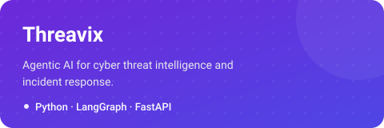</a></td>
    <td width="50%"></td>
  </tr>
  <tr>
    <td width="50%"><a href="https://github.com/sumansingh20/Synthera-AI">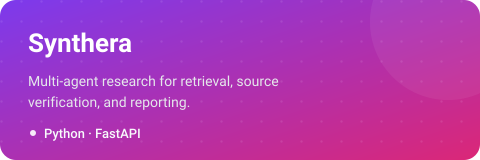</a></td>
    <td width="50%"><a href="https://github.com/sumansingh20/Orchestrix-Fault-Tolerant-Distributed-Scheduler">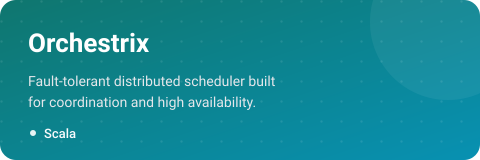</a></td>
  </tr>
  <tr>
    <td width="50%"><a href="https://github.com/sumansingh20/Nebula-Cloud-Native-Distributed-Compute-Platform">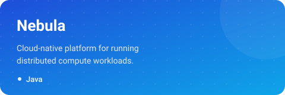</a></td>
    <td width="50%"><a href="https://github.com/sumansingh20/Nimbus-Scalable-Fault-Tolerant-Distributed-Data-Processing-Engine">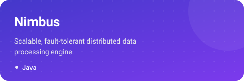</a></td>
  </tr>
  <tr>
    <td width="50%"><a href="https://github.com/sumansingh20/Aegis-Offensive-Security-Framework">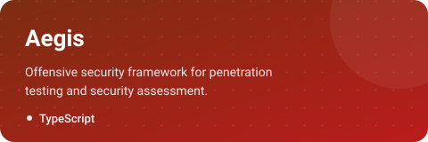</a></td>
    <td width="50%"><a href="https://github.com/sumansingh20/kavach-infinity">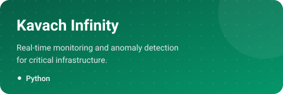</a></td>
  </tr>
</table>

## Coding profiles

- [LeetCode](https://leetcode.com/sumansingh20)
- [Codeforces](https://codeforces.com/profile/sumankumar20)
- [CodeChef](https://www.codechef.com/users/sumankumar01)
- [GeeksforGeeks](https://www.geeksforgeeks.org/profile/sumansingh20)
- [Hack The Box](https://profile.hackthebox.com/profile/019ecc5a-9777-708a-aa0f-e71c2dc5d599)

## Contact

- Email: [sumantech07@gmail.com](mailto:sumantech07@gmail.com)
- LinkedIn: [in/sumankumar-](https://www.linkedin.com/in/sumankumar-/)
- GitHub: [sumansingh20](https://github.com/sumansingh20)

  

